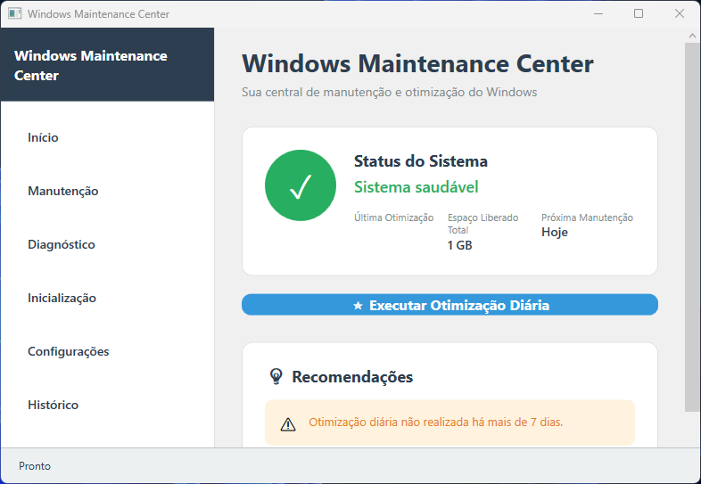
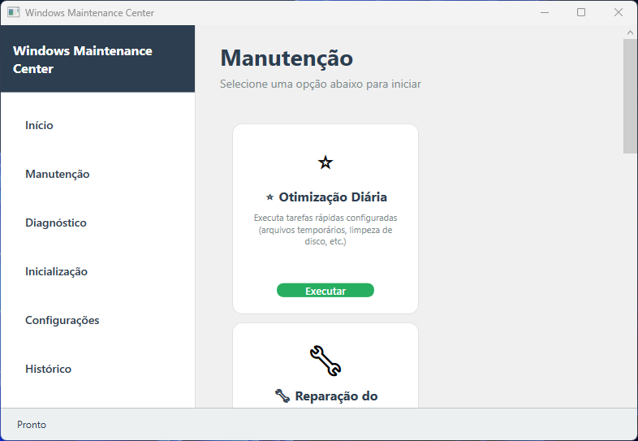
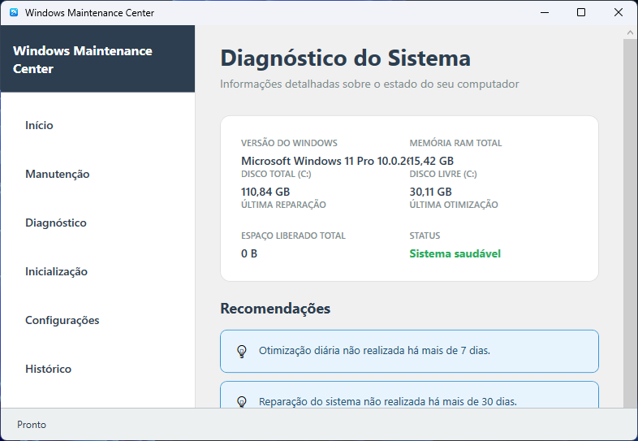
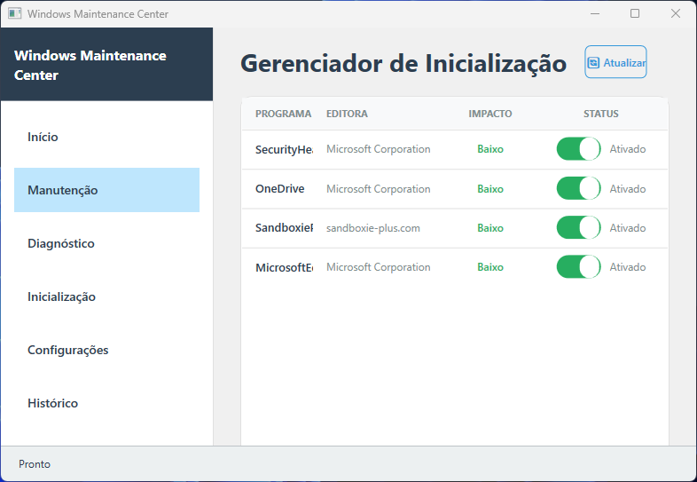
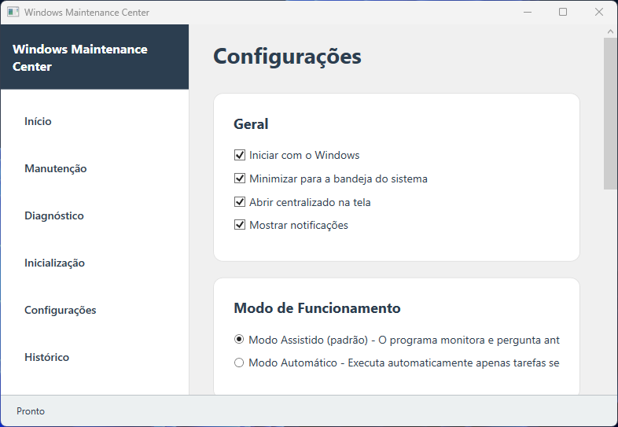
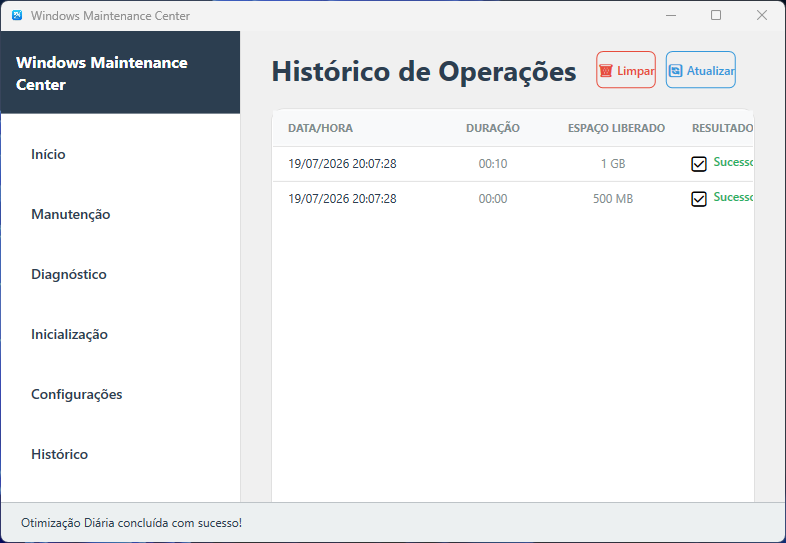

# Windows Maintenance Center (WMC)

<p align="center">
  <strong>Ferramenta completa de manutenção, limpeza e otimização para Windows</strong>
</p>

<p align="center">
  
  
  
  
  
</p>

---

## Sobre o Projeto

O **Windows Maintenance Center (WMC)** é uma aplicação desktop desenvolvida em **C#/.NET 10** com interface em **WPF**, projetada para ser uma solução completa e moderna para manutenção, limpeza e otimização de sistemas Windows.

O projeto é uma **reescrita completa** de um aplicativo original desenvolvido em Python/Tkinter, trazendo benefícios significativos como arquitetura modular (MVVM + DI), interface moderna estilo Windows 11, persistência de dados, automação de tarefas e diagnóstico avançado via WMI.

### Propósito

O WMC foi criado para fornecer aos usuários Windows uma ferramenta centralizada e acessível para:

- **Limpar arquivos temporários e desnecessários** que ocupam espaço em disco
- **Reparar integridade do sistema** usando DISM e SFC
- **Realizar limpeza profunda** com ResetBase do DISM
- **Diagnosticar o estado do sistema** com informações detalhadas via WMI
- **Gerenciar programas de inicialização** diretamente pelo registro do Windows
- **Agendar manutenções automáticas** sem intervenção do usuário
- **Minimizar para a bandeja do sistema** e iniciar automaticamente com o Windows

---

## Screenshots

<p align="center">
  
</p>

<p align="center">
  
</p>

<p align="center">
  
</p>

<p align="center">
  
</p>

<p align="center">
  
</p>

<p align="center">
  
</p>

---

## Funcionalidades

### Interface (6 Abas)

| Aba | Descrição |
|-----|-----------|
| **Inicio** | Dashboard com status do sistema, última otimização, espaço liberado total e botão rápido de otimização diária |
| **Manutenção** | 6 cartões de ação com tarefas de manutenção de不同的 níveis |
| **Diagnóstico** | Informações detalhadas do sistema: versão Windows, RAM, disco, recomendações inteligentes |
| **Inicialização** | Gerenciador de programas que iniciam com o Windows (ativação/desativação via Registro) |
| **Configurações** | Configurações gerais, modo de operação (Assistido/Automático) e frequência de tarefas |
| **Histórico** | Log completo de todas as operações com data, duração, resultado, espaço liberado e exclusão seletiva via checkboxes |

### Bandeja do Sistema e Auto-Start

| Funcionalidade | Descrição |
|----------------|-----------|
| **Minimizar para bandeja** | Ao clicar no X, o programa minimiza para a bandeja do sistema (ícone ao lado do relógio) |
| **Restaurar da bandeja** | Duplo-clique no ícone da bandeja restaura a janela |
| **Menu da bandeja** | Botão direito no ícone: "Abrir" ou "Sair" |
| **Iniciar com Windows** | Configuração na aba Configurações para iniciar automaticamente no login do Windows (via registro HKCU) |
| **Auto-start minimizado** | Ao iniciar com o Windows, abre diretamente na bandeja (minimizado) |

### Tarefas de Manutenção

| Tarefa | Descrição | Comandos Utilizados |
|--------|-----------|---------------------|
| **Otimização Diária** | Limpeza rápida de arquivos temporários | `del /q /f /s %TEMP%\*` + `cleanmgr /sagerun:1` |
| **Reparação do Sistema** | Verificação e reparo de integridade | DISM CheckHealth, ScanHealth, RestoreHealth + `sfc /scannow` |
| **Limpeza Leve** | Limpeza de sistema + componentes | `cleanmgr /sageset:1` + DISM StartComponentCleanup |
| **Limpeza Profunda** | Limpeza máxima com ResetBase | `cleanmgr /sagerun:1` + DISM StartComponentCleanup `/ResetBase` |
| **Reparação + Limpeza Leve** | Reparo seguido de limpeza | Pipeline de reparo + Limpeza Leve |
| **Reparação Completa** | Manutenção total do sistema | Reparo + CHKDSK + Limpeza Profunda |

### Arquitetura Back-end

O projeto conta com **11 serviços** especializados que executam as operações de sistema:

- **MaintenanceEngine** - Executor genérico de comandos de manutenção via `cmd.exe`
- **SystemRepairEngine** - Pipeline completo de reparo (DISM + SFC + CHKDSK)
- **DeepCleanEngine** - Motor de limpeza profunda com cleanmgr e DISM ResetBase
- **DiagnosticService** - Coleta de informações do sistema via WMI (Win32_OperatingSystem, Win32_ComputerSystem)
- **StartupManager** - Gerenciamento de programas de inicialização via Registro (HKLM/HKCU Run) + auto-start do WMC
- **AutomationService** - Timer para execução automática de tarefas agendadas
- **ConfigService** - Persistência de configurações em JSON (`Config/configuracoes.json`)
- **HistoryService** - Persistência de histórico de operações em JSON (`Logs/historico.json`)
- **NotificationService** - Sistema de notificações para o usuário (toast)
- **SoundService** - Feedback sonoro via SystemSounds do Windows
- **LoggingService** - Logging centralizado em arquivos diários (`Logs/log_YYYYMMDD.txt`)

### Sons do Sistema

| Evento | Som |
|--------|-----|
| Operação concluída | `SystemSounds.Asterisk` |
| Aviso/Sucesso parcial | `SystemSounds.Exclamation` |
| Erro | `SystemSounds.Hand` |

---

## Requisitos

| Requisito | Detalhe |
|-----------|---------|
| **Sistema Operacional** | Windows 10 ou Windows 11 |
| **Runtime** | [.NET 10.0 Runtime](https://dotnet.microsoft.com/download/dotnet/10.0) |
| **Privilégios** | Executar como **Administrador** (obrigatório para DISM, SFC, CHKDSK) |
| **Disco** | ~50 MB de espaço livre para instalação |

---

## Instalação e Build

### Compilar a partir do código fonte

```bash
# Clonar o repositório
git clone https://github.com/Marcos-Vitor123/WindowsMaintenanceCenter-Publico.git
cd WindowsMaintenanceCenter-Publico

# Compilar
dotnet build

# Executar (necessário ser administrador)
dotnet run
```

### Publicação dependente do Runtime (recomendado)

```bash
dotnet publish -c Release -r win-x64 --self-contained false
```

O executável é gerado em `bin\Release\net10.0-windows\win-x64\publish\WindowsMaintenanceCenter.exe` (~1 MB).

---

## Estrutura do Projeto

```
WindowsMaintenanceCenter/
├── App.xaml / App.xaml.cs              # Ponto de entrada, container DI, --minimized handler
├── MainWindow.xaml / .cs               # (Não utilizado - scaffold leftover)
├── Converters.cs                       # Value converters para data binding
├── docs/img/                           # Screenshots do programa
│
├── Assets/
│   └── ico.ico                         # Ícone do aplicativo (bandeja + janela)
│
├── Models/                             # Modelos de dados
│   ├── AppConfig.cs                    # Configurações do usuário (StartWithWindows, MinimizeToTray, etc.)
│   ├── HistoryEntry.cs                 # Entrada de log de operação (INotifyPropertyChanged, JsonIgnore)
│   ├── MaintenanceTask.cs             # Definição de tarefa
│   ├── StartupEntry.cs                # Programa de inicialização
│   └── SystemInfo.cs                  # Informações do sistema
│
├── Services/                           # Lógica de negócio (11 serviços)
│   ├── ILogger.cs                      # Interface de log
│   ├── LoggingService.cs              # Logging centralizado em arquivos diários
│   ├── MaintenanceEngine.cs            # Executor de comandos via cmd.exe /c "{command}"
│   ├── SystemRepairEngine.cs           # Reparo DISM/SFC/CHKDSK (Encoding.UTF8)
│   ├── DeepCleanEngine.cs              # Limpeza profunda (Encoding.UTF8)
│   ├── DiagnosticService.cs            # Diagnóstico WMI
│   ├── StartupManager.cs              # Gerenciador de inicialização + auto-start do WMC
│   ├── AutomationService.cs            # Automação por timer
│   ├── ConfigService.cs               # Persistência de config (atomic writes)
│   ├── HistoryService.cs              # Persistência de histórico
│   ├── NotificationService.cs          # Notificações toast
│   └── SoundService.cs                # Sons do sistema
│
├── ViewModels/                         # ViewModels MVVM
│   ├── ViewModelBase.cs               # Base INotifyPropertyChanged
│   ├── MainViewModel.cs               # Shell, navegação, RelayCommand<T> e RelayCommand
│   ├── HomeViewModel.cs               # Dashboard
│   ├── MaintenanceViewModel.cs         # Tarefas de manutenção
│   ├── DiagnosticsViewModel.cs         # Diagnóstico
│   ├── StartupViewModel.cs            # Programas de inicialização
│   ├── SettingsViewModel.cs           # Configurações (aplica auto-start ao salvar)
│   └── HistoryViewModel.cs            # Histórico com checkboxes e exclusão seletiva
│
├── Views/                              # Interface WPF
│   ├── MainWindow.xaml / .cs           # Janela principal (sidebar, NotifyIcon, tray)
│   ├── HomeView.xaml / .cs             # Página inicial
│   ├── MaintenanceView.xaml / .cs      # Página de manutenção
│   ├── DiagnosticsView.xaml / .cs      # Página de diagnóstico
│   ├── StartupView.xaml / .cs          # Página de inicialização
│   ├── SettingsView.xaml / .cs         # Página de configurações
│   ├── HistoryView.xaml / .cs          # Página de histórico (checkboxes + Excluir Selecionados)
│   └── Converters.cs                  # Converters da Views
│
├── Resources/
│   └── Styles.xaml                     # Estilos WPF compartilhados
│
├── Config/
│   └── configuracoes.json              # Configurações persistidas (runtime)
│
└── Logs/
    ├── historico.json                  # Histórico de operações (runtime)
    └── log_YYYYMMDD.txt               # Logs diários (runtime)
```

---

## Diferenças em Relação ao Projeto Original (Python/Tkinter)

| Aspecto | Python/Tkinter | WMC (.NET/WPF) |
|---------|----------------|-----------------|
| **Arquitetura** | Monolítica | MVVM + Dependency Injection |
| **Interface** | Tkinter básica | WPF moderno estilo Windows 11 |
| **Navegação** | 5 botões | 6 abas com sidebar (200px) |
| **Persistência** | Nenhuma | JSON (config + histórico) |
| **Bandeja do sistema** | Não | Sim (NotifyIcon com menu contextual) |
| **Auto-start** | Não | Sim (registro HKCU com --minimized) |
| **Gerenciador de inicialização** | Não | Sim (Registro Windows) |
| **Modo automático** | Não | Sim (agendamento por tarefa) |
| **Logging** | Não | Sim (arquivos diários com timestamps) |
| **Diagnóstico** | Básico | WMI (Win32_OperatingSystem, Win32_ComputerSystem) |
| **Sons** | Sim | Sim (SystemSounds) |
| **Reparo de sistema** | Parcial | Pipeline completo (DISM + SFC + CHKDSK) |
| **Feedback visual** | Nenhum | Toast notifications + barra de progresso |
| **Exclusão seletiva** | Não | Sim (checkboxes no histórico) |

---

## Licença

Este projeto está sob a licença MIT. Veja o arquivo [LICENSE](LICENSE) para mais detalhes.

---

## Contribuição

Contribuições são bem-vindas! Para contribuir:

1. Faça um Fork do repositório
2. Crie uma branch para sua feature (`git checkout -b feature/nova-feature`)
3. Faça commit das suas alterações (`git commit -m 'Adiciona nova feature'`)
4. Push para a branch (`git push origin feature/nova-feature`)
5. Abra um Pull Request

---

## Autor

**Marcos Vitor** - [GitHub](https://github.com/Marcos-Vitor123)

---

## Desenvolvimento

Este projeto foi desenvolvido com **Inteligência Artificial (IA)** em conjunto com **interação humana**, onde cada decisão, comando e resultado passou por **revisão e validação do desenvolvedor**. A IA atuou como ferramenta de auxílio na geração de código, documentação e arquitetura, sendo o humano o responsável pela supervisão, correção e aprovação final de todo o conteúdo.
